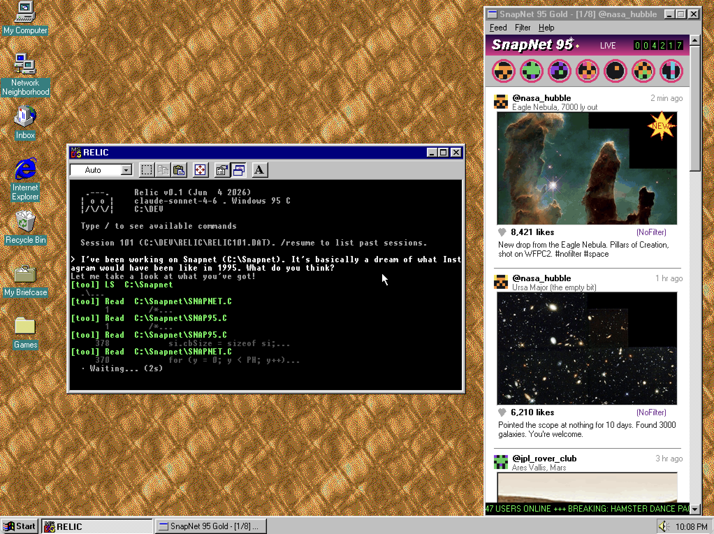

# Relic

Relic is a minimal coding agent in the style of Claude Code, written in portable C99
so it runs on very old operating systems and machines with very little
memory. It makes next-to-no assumptions about what
the environment provides: HTTP, JSON output, and the terminal UI are
hand-rolled on top of a tiny per-platform porting layer.

If your machine can run the real [Claude Code](https://claude.com/claude-code),
or a similar coding agent, you should run that instead. Relic is for hardware
and operating systems that can't.

Downloads for all supported platforms can be found in the
[latest GitHub release](https://github.com/felixrieseberg/relic/releases/latest).

## Supported platforms

| Target | Operating systems | Runtime requirements |
|---|---|---|
| posix | any modern POSIX (macOS, Linux, *BSD) | libc, BSD sockets |
| win32 | Windows 95 and newer (1995) | KERNEL32, USER32, WSOCK32 (Winsock 1.1) |
| macppc | PowerPC Mac OS 8.1 and newer (1998) | Open Transport TCP/IP, AppleScript |
| xbox | Microsoft Xbox (2001) | ability to run unsigned XBEs, USB keyboard |
| wii | Nintendo Wii (2006) | Homebrew Channel, SD card, USB or GC keyboard |

## Requirements

- **4 MB of RAM** and about **400–900 KB of disk** for the program itself
- A working **TCP/IP** connection to the internet
- An **Anthropic API key** (put it in `RELIC.CFG` next to the program, or
  set `ANTHROPIC_API_KEY`)

## Tools implemented

- **Shell**: run code (bash, command.com, AppleScript, or embedded Lua —
  whichever the target has)
- **Read**: read a file
- **Write**: write a file
- **Edit**: replace a string in a file
- **LS**: list a directory
- **Grep**: search file contents
- **Glob**: match file paths against a pattern

## Slash commands

Type `/` on its own at the prompt to list these. Anything that doesn't start
with `/` is sent to the model as a prompt.

| Command | Description |
|---|---|
| `/help` | show the command list |
| `/status [KEY [VAL]]` | show version, cwd, API key, session and config; with `KEY VAL`, change one setting (`model`, `proxy`, `ip`, `verbose`, `yolo`, `edits`, `tools`, `max_tokens`) |
| `/clear` | clear the current conversation history (alias `/reset`) |
| `/resume [N]` | list saved sessions, or switch to session `N` |
| `/export [PATH]` | write the transcript to a text file (defaults to `RELICnnn.TXT`; `/verbose` adds a debug header) |
| `/model [NAME]` | list models available to your API key, or switch to `NAME` |
| `/test SUB` | run a self-test: `network` (DNS/TCP/TLS to the API host) or `tools` (shell + Read/Write/Edit round-trip) |
| `/proxy [HOST:PORT]` | set an HTTP CONNECT proxy; blank clears it |
| `/scroll` | open the scrollback viewer (same as pressing PgUp at an empty prompt) |
| `/verbose [N]` | toggle or set the trace level |
| `/quit` | exit (alias `/exit`) |

## Safety

Relic is a thin pipe between an LLM and your shell. There is **no
sandbox** on any platform. There are no safeguards other than permission
prompts.

## Building

See [docs/BUILDING.md](docs/BUILDING.md) for build instructions, and
[docs/DECISIONS.md](docs/DECISIONS.md) for the design rationale.
